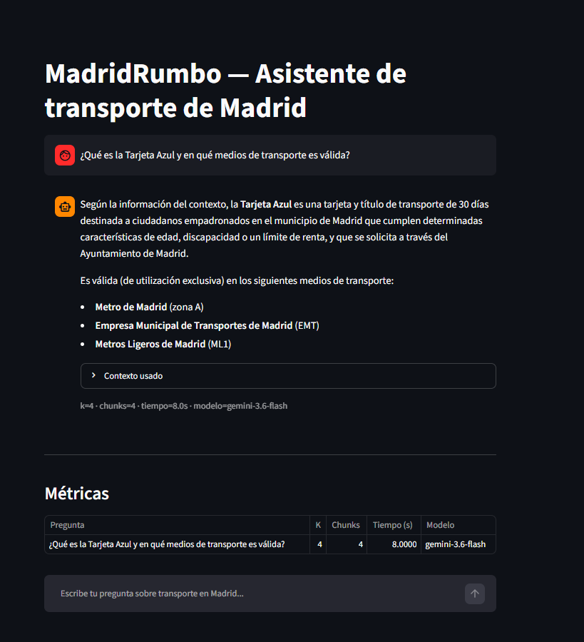
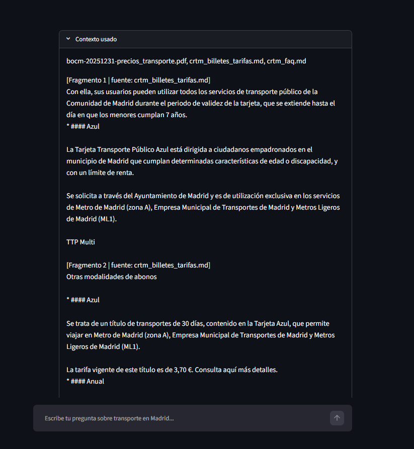
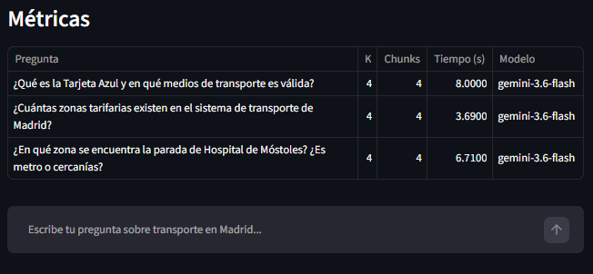
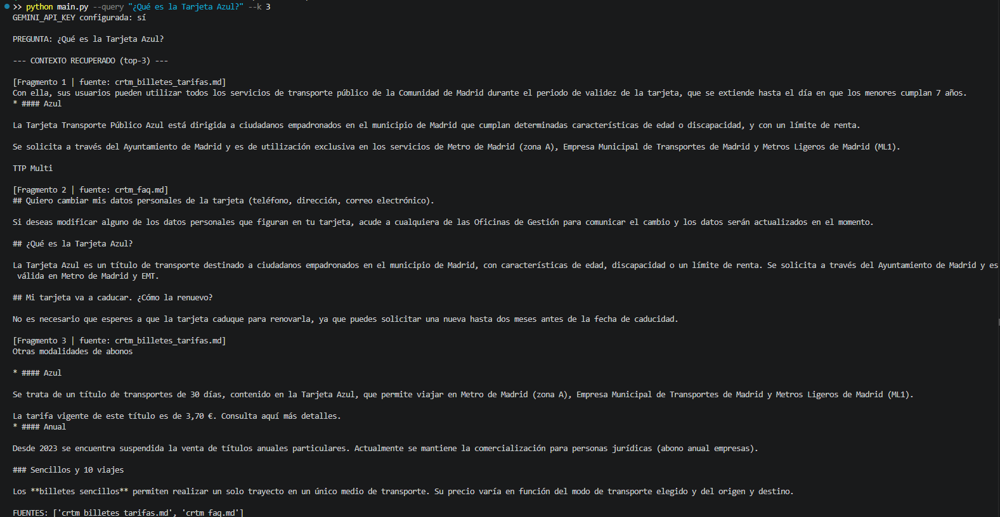
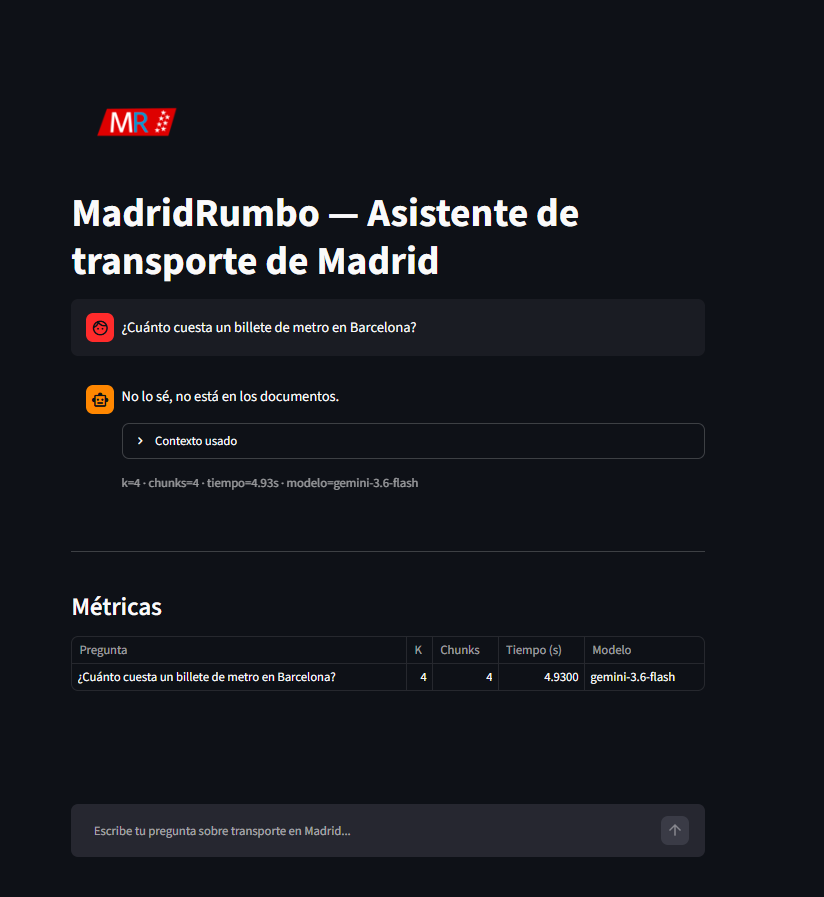

# MadridRumbo
> **Project Break · Sprints 08–10 | AI Engineering Bootcamp**
> **Grupo 3:** Rubén Jiménez Gutiérrez, Guzmán López Barceló, José Manuel Gil Ruiz.

## Alcance

MadridRumbo es un asistente RAG especializado en transporte público de la Comunidad de Madrid, orientado a resolver consultas sobre tarifas, títulos de transporte, zonas tarifarias, condiciones de uso y paradas, utilizando exclusivamente la información disponible en su corpus documental.

**Ejemplos de preguntas dentro del alcance:**

- ¿Qué es la Tarjeta Azul y en qué medios de transporte es válida?
- ¿Cuántas zonas tarifarias existen en el sistema de transporte de Madrid?
- ¿En qué zona tarifaria se encuentra la parada de Plaza de Castilla?

**Ejemplos de preguntas fuera del alcance:**
- ¿Cuánto cuesta un billete de metro en Barcelona?
- ¿Cuál es el horario de apertura de la estación de Atocha hoy?

## Corpus

Todas las fuentes se han descargado el día 07/09/2026:
- Paradas CRTM.csv
  - Contiene la información relevante sobre las estaciones o paradas de la red de transporte público.
  - Fuente: https://datos.crtm.es/search?type=CSV%2520Collection
    - De aquí se escogen los siguientes datasets:
      - Metro: https://datos.crtm.es/datasets/5c7f2951962540d69ffe8f640d94c246
      - Metro Ligero: https://datos.crtm.es/datasets/aaed26cc0ff64b0c947ac0bc3e033196
      - Trenes de Cercanías: https://datos.crtm.es/datasets/1a25440bf66f499bae2657ec7fb40144
      - Autobuses EMT: https://datos.crtm.es/datasets/868df0e58fca47e79b942902dffd7da0
      - Autobuses Interurbanos: https://datos.crtm.es/datasets/885399f83408473c8d815e40c5e702b7
      - Autobuses urbanos: https://datos.crtm.es/datasets/357e63c2904f43aeb5d8a267a64346d8
  - Se selecciona de cada colección de GTFS los archivos stops.txt y unificados en un solo csv tratado para eliminar filas y campos innecesarios.
    - Solamente se mantienen las filas correspondientes a estaciones o paradas que tienen información sobre la zona de tarificación en la que se encuentran.
    - Solamente se mantienen los campos stop_id, stop_name, stop_desc, y zone_id.
    - Se añade un nuevo campo type con información sobre el tipo de medio de transporte de cada estación o parada: Metro,	Metro Ligero,	Trenes Cercaní­as,	Autobús EMT,	Autobús Interurbano y	Autobús Urbano    
- crtm_billetes_tarifas.md
  - Fuente: https://www.crtm.es/billetes-y-tarifas/
  - Se scrappea la información relevante.
- crtm_faq.md
  - Fuente: https://www.crtm.es/billetes-y-tarifas/preguntas-frecuentes/
  - Se scrappea de la web.
- https://www.crtm.es/media/sjqj4ggj/bocm-20251231-tarifas_transporte.pdf
- https://www.crtm.es/media/s1qi0nmo/bocm-20251231-precios_transporte.pdf

---

## Arquitectura del proyecto

MadridRumbo utiliza una arquitectura modular en la que cada etapa del sistema RAG está separada en componentes independientes. Esto facilita el desarrollo, las pruebas y la futura reutilización del sistema.

El flujo principal es:

```text
Documentos
    ↓
Carga y limpieza
    ↓
Chunking
    ↓
Embeddings
    ↓
ChromaDB
    ↓
Retrieval
    ↓
Generación
    ↓
CLI / Streamlit
```

### Estructura del proyecto

```text
MadridRumbo/
│
├── main.py                     # Punto de entrada por CLI
├── app.py                      # Interfaz web con Streamlit
├── config.py                   # Configuración general del proyecto
├── prompt.py                   # Plantilla del prompt de generación
├── requirements.txt            # Dependencias
├── .env.example                # Plantilla de variables de entorno
│
├── src/
│   ├── load.py                 # Carga del corpus
│   ├── clean.py                # Limpieza y normalización
│   ├── chunk.py                # Fragmentación de documentos
│   ├── pipeline.py             # Orquestación de la ingesta
│   ├── embed.py                # Generación de embeddings
│   ├── index.py                # Indexación en ChromaDB
│   ├── retrieve.py             # Recuperación de chunks
│   ├── generate.py             # Generación de respuestas
│   ├── responder.py            # Une retrieval y generación
│   ├── model_auth.py           # Configuración de API keys
│   └── utils.py                # Funciones auxiliares
│
├── data/                       # Corpus documental
├── output/                     # Chunks y embeddings generados
├── chroma/                     # Base de datos vectorial persistente
├── queries/                    # Preguntas y resultados de evaluación
├── assets/                     # Recursos de la interfaz
├── entregables/                # Entregables del proyecto
│
├── eval_retrieval.py           # Evaluación del retrieval
└── eval_generacion.py          # Evaluación de la generación
```

### Componentes principales

| Componente                          | Responsabilidad                                                                     |
| ----------------------------------- | ----------------------------------------------------------------------------------- |
| `load.py` / `clean.py` / `chunk.py` | Preparación y fragmentación del corpus.                                             |
| `embed.py`                          | Conversión de los chunks y consultas en embeddings.                                 |
| `index.py`                          | Persistencia de los embeddings y documentos en ChromaDB.                            |
| `retrieve.py`                       | Recuperación de los chunks más relevantes para una consulta.                        |
| `prompt.py`                          | Plantilla del prompt (`PROMPT_TEMPLATE`), separada de la lógica de generación para poder reutilizarla en futuros trabajos. |
| `generate.py`                       | Generación de respuestas utilizando exclusivamente el contexto recuperado. Importa el prompt desde `prompt.py`.          |
| `responder.py`                      | Centraliza el flujo `retrieve → generate` y devuelve respuesta, fuentes y métricas. |
| `main.py`                           | Expone las operaciones principales mediante CLI.                                    |
| `app.py`                            | Proporciona la interfaz gráfica mediante Streamlit.                                 |

Esta separación permite que la lógica del RAG sea independiente de la interfaz y pueda reutilizarse posteriormente desde otros componentes o aplicaciones.

---

## Preparación del entorno

### 1. Crear y activar un entorno virtual

Se recomienda utilizar Python 3.10 o superior.

```bash
python -m venv .venv
```

Activación en Windows:

```bash
.venv\Scripts\activate
```

Activación en Linux/macOS:

```bash
source .venv/bin/activate
```

### 2. Instalar dependencias

```bash
pip install -r requirements.txt
```

El proyecto utiliza, entre otras dependencias, LangChain, ChromaDB, Gemini/OpenAI y Streamlit.

### 3. Configurar las variables de entorno

Crear un archivo `.env` a partir de `.env.example`.

Windows:

```bash
copy .env.example .env
```

Linux/macOS:

```bash
cp .env.example .env
```

Añadir las API keys necesarias:

```env
GEMINI_API_KEY=tu_api_key
OPENAI_API_KEY=tu_api_key
```

Actualmente el proyecto permite utilizar **Gemini** u **OpenAI** para la generación de embeddings. El proveedor y el modelo utilizados se configuran en `config.py`.

> Nunca deben incluirse las API keys directamente en el código ni subirse al repositorio.

---

## Proceso de carga e indexado

MadridRumbo separa la preparación del corpus de su indexación en la base de datos vectorial.

El flujo general es:

```text
Documentos
    ↓
Carga
    ↓
Limpieza
    ↓
Chunking
    ↓
Embeddings
    ↓
ChromaDB
```

### 1. Preparar el corpus

```bash
python main.py --prepare
```

Este comando ejecuta las fases de **carga, limpieza, fragmentación y generación de embeddings**.

Como resultado se generan principalmente:

* `output/chunks.json`: contiene los chunks y sus metadatos.
* `output/embeddings.json`: contiene los vectores generados para cada chunk.

### 2. Crear el índice vectorial

```bash
python main.py --index
```

Los chunks se indexan en una colección persistente de **ChromaDB**, almacenando también metadatos como la fuente y el identificador de cada fragmento.

Si `chunks.json` ya existe, el comando lo reutiliza sin repetir todo el proceso de ingesta.

### 3. Regenerar completamente el índice

Cuando se modifica el corpus, el modelo de embeddings o alguna configuración que afecte a los vectores, puede reconstruirse la colección desde cero:

```bash
python main.py --index --recreate-index
```

### Configuración principal

Los parámetros más relevantes se encuentran centralizados en `config.py`:

* `CHUNK_SIZE` y `CHUNK_OVERLAP`: configuración del chunking.
* `EMBEDDING_PROVIDER` y `EMBEDDING_MODEL`: proveedor y modelo de embeddings.
* `EMBED_BATCH_SIZE`: tamaño de los lotes enviados al modelo.
* `MAX_CHUNKS`: límite de chunks indexados.
* `CHROMA_DIR`: ubicación de la base de datos vectorial.
* `COLLECTION_NAME`: nombre de la colección de ChromaDB.

### Proveedores de embeddings

MadridRumbo permite utilizar distintos proveedores manteniendo una interfaz común para la generación de embeddings.

| Proveedor | Modelo                   |
| --------- | ------------------------ |
| Gemini    | `gemini-embedding-2`     |
| OpenAI    | `text-embedding-3-small` |

El proveedor activo se selecciona mediante `EMBEDDING_PROVIDER` en `config.py`. En función del proveedor elegido, el sistema utiliza automáticamente el modelo correspondiente y requiere la API key asociada (`GEMINI_API_KEY` u `OPENAI_API_KEY`).

La generación de embeddings se realiza por lotes mediante `EMBED_BATCH_SIZE`. En el caso de Gemini, el pipeline incorpora además control de límites de peticiones mediante `EMBED_RPM_LIMIT`.


---

## Recuperación y generación

Una vez construido el índice vectorial, MadridRumbo puede recuperar información relevante del corpus y utilizarla como contexto para generar una respuesta.

El flujo de consulta es:

```text
Pregunta
   ↓
Embedding de la consulta
   ↓
Búsqueda en ChromaDB
   ↓
Top-K chunks más relevantes
   ↓
Contexto
   ↓
LLM
   ↓
Respuesta
```

### Recuperación de información

Es posible ejecutar únicamente la fase de **retrieval**, sin realizar ninguna llamada al modelo generativo:

```bash
python main.py --query "¿Qué es la Tarjeta Azul?"
```

El sistema genera el embedding de la consulta, busca en ChromaDB los `K` chunks semánticamente más próximos y muestra tanto el contexto recuperado como sus fuentes.

El número de fragmentos recuperados puede modificarse mediante `--k`:

```bash
python main.py --query "¿Qué es la Tarjeta Azul?" --k 6
```

Por defecto se utiliza el valor `TOP_K` configurado en `config.py`.

### Generación RAG

Para ejecutar el flujo completo de recuperación y generación:

```bash
python main.py --ask "¿Qué es la Tarjeta Azul?"
```

El sistema recupera primero los chunks relevantes y los incorpora al prompt como contexto. A continuación, el modelo generativo produce la respuesta utilizando exclusivamente esa información.

También puede modificarse el número de chunks utilizados:

```bash
python main.py --ask "¿Qué es la Tarjeta Azul?" --k 6
```

### Grounding y abstención

MadridRumbo está diseñado para generar respuestas **ancladas al corpus**. El modelo recibe instrucciones explícitas para utilizar únicamente el contexto recuperado.

Si dicho contexto no contiene información suficiente para responder, el sistema debe abstenerse utilizando la respuesta:

> `No lo sé, no está en los documentos.`

De esta forma se reduce el riesgo de generar información no respaldada por las fuentes del proyecto.

### Configuración de generación

Los principales parámetros se encuentran en `config.py`:

* `TOP_K`: número de chunks recuperados.
* `GENERATION_MODEL`: modelo utilizado para generar la respuesta.
* `TEMPERATURE`: controla la variabilidad de la generación.

### Logging

Las consultas realizadas mediante el flujo RAG se registran automáticamente en el archivo `rag.log`.

Para cada consulta se almacenan:

* Pregunta realizada.
* Valor de `K` utilizado.
* Número de chunks recuperados.
* Tiempo total de respuesta.
* Modelo generativo utilizado.

La función `responder()` centraliza el flujo de recuperación, generación y logging, por lo que tanto el CLI como la interfaz Streamlit utilizan el mismo comportamiento interno.

Esto permite disponer de trazabilidad básica sobre el funcionamiento del sistema y facilita el análisis posterior de las consultas.


---

## Interfaz de usuario

MadridRumbo incluye una interfaz web desarrollada con **Streamlit** para interactuar con el sistema RAG de forma sencilla.

Para iniciar la aplicación:

```bash
python -m streamlit run app.py
```

La interfaz permite:

* Introducir preguntas mediante un chat.
* Visualizar la respuesta generada por el sistema.
* Consultar las fuentes y el contexto recuperado para cada respuesta.
* Mantener el historial de preguntas durante la sesión.
* Mostrar métricas básicas como `K`, número de chunks recuperados, tiempo de respuesta y modelo utilizado.
 
La interfaz utiliza la misma función `responder()` que el CLI, por lo que ambos métodos de acceso comparten el mismo flujo de recuperación y generación.

```text
Usuario
   ↓
Streamlit
   ↓
responder()
   ↓
Retrieval + Generación
   ↓
Respuesta + fuentes + métricas
```

De esta forma, la interfaz se mantiene separada de la lógica interna del RAG y actúa únicamente como capa de presentación.

---

## Evaluación

MadridRumbo incluye una evaluación básica del sistema RAG dividida en dos capas independientes:

* **Evaluación de retrieval:** comprueba si el sistema recupera las fuentes esperadas para cada pregunta.
* **Evaluación de generación:** comprueba si el sistema responde cuando existe evidencia en el corpus y se abstiene cuando la pregunta queda fuera de su alcance.

El conjunto de evaluación se encuentra en:

```text
queries/eval_preguntas.json
```

Actualmente contiene **15 preguntas**, incluyendo casos dentro y fuera del corpus, junto con la fuente esperada y un criterio de evidencia para cada una.

### Evaluación de retrieval

Para evaluar la recuperación de información:

```bash
python eval_retrieval.py --k 3 4
```

El script ejecuta las mismas preguntas con distintos valores de `K` y comprueba si la fuente esperada aparece entre los chunks recuperados.

Esto permite observar cómo afecta el número de fragmentos recuperados a la calidad del retrieval y detectar posibles problemas de ruido o pérdida de información relevante.

Los resultados se almacenan en:

```text
queries/eval_retrieval_resultados.json
```

### Evaluación de generación

Para evaluar el comportamiento completo del RAG:

```bash
python eval_generacion.py
```

Para cada pregunta se comprueba:

* En preguntas **in-corpus**, que el sistema genere una respuesta.
* En preguntas **fuera de corpus**, que se abstenga correctamente en lugar de inventar información.

Los resultados se guardan progresivamente en:

```text
queries/eval_generacion_resultados.json
```

El guardado incremental permite continuar una evaluación interrumpida sin repetir las preguntas ya procesadas.

### Criterios principales

La evaluación busca comprobar principalmente:

* Recuperación de fuentes relevantes.
* Grounding de las respuestas en el corpus.
* Capacidad de abstención ante preguntas sin evidencia.
* Efecto de distintos valores de `K` sobre el retrieval.

---

## Limitaciones conocidas

MadridRumbo es un proyecto académico y presenta algunas limitaciones propias de su alcance y de la arquitectura implementada:

* **Información limitada al corpus:** el sistema únicamente puede responder utilizando la información previamente incorporada al corpus. No consulta información en tiempo real, por lo que no puede responder de forma fiable sobre incidencias, horarios actuales o cambios posteriores a la fecha de actualización de las fuentes.

* **Limitación del retrieval en consultas composicionales:** el sistema no es capaz de responder preguntas como `¿Cuál es el precio del billete para ir desde las Estación A hasta la Estación B?` ya que al buscar los chunks semánticamente más próximos todos proceden de `Paradas CRTM.csv` y nunca consigue recuperar la información sobre la tarificación de la que dispone.

* **Extracción de información desde PDF:** algunos documentos oficiales contienen tablas cuya estructura puede perderse parcialmente durante la extracción a texto. Esto puede dificultar la recuperación de determinados precios o condiciones aunque la información esté presente visualmente en el documento original.

* **Retrieval exclusivamente vectorial:** la recuperación actual se basa en similitud semántica mediante embeddings y búsqueda Top-K en ChromaDB. No se utilizan técnicas adicionales como búsqueda híbrida o reranking, por lo que el fragmento más relevante no siempre tiene por qué aparecer entre los primeros resultados.

* **Dependencia de servicios externos:** la generación de embeddings y respuestas depende de APIs externas. Los límites de cuota, disponibilidad o rate limits del proveedor pueden afectar temporalmente a la ejecución de determinados procesos.

Estas limitaciones constituyen posibles líneas de mejora para futuras iteraciones del proyecto.

---

## Demo y capturas

MadridRumbo puede utilizarse tanto mediante su interfaz web desarrollada con Streamlit como desde la línea de comandos.

### Interfaz Streamlit

La interfaz permite realizar consultas mediante un chat y visualizar directamente la respuesta generada por el sistema.



Para facilitar la trazabilidad de las respuestas, cada consulta permite inspeccionar las fuentes y el contexto recuperado utilizado durante la generación.



La aplicación muestra también métricas básicas de ejecución, como el valor de `K`, el número de chunks recuperados, el tiempo de respuesta y el modelo utilizado.



### Uso mediante CLI

El sistema también permite ejecutar únicamente la fase de retrieval desde la línea de comandos, mostrando los chunks y fuentes recuperados antes de realizar la generación.



### Abstención ante preguntas fuera del corpus

Cuando no existe evidencia suficiente en el corpus, MadridRumbo se abstiene de generar una respuesta no fundamentada.


